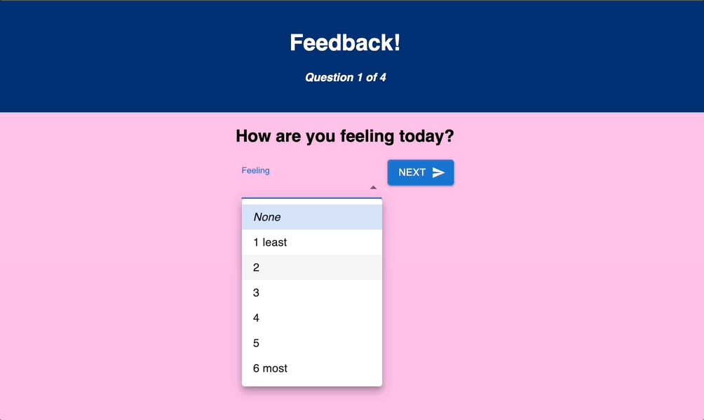

# weekend-redux-feedback-loop# redux-feedback-loop

## Introduction
This was a weekend sprint project to practice React and Redux. We had a wireframe to follow to setup a simple app for providing feedback for student experiences with a learning program.

## Contents

This projects contains:

Components for:
Questions (4 pages for different questions)
Review (displays answers from the Store for review, submit will POST to DB, clears Store)
Confirmed (confimration page, allows to navigate back for another survey)

To get started:
Open terminal and run 'npm run server'
Open a second terminal and 'npm run client'

This will navigate you to the landing page!
## Authors

This was great practice for React, React-Router and Redux for me. Additionally I used MaterialUI for the first time in this project and really enjoyed the ability to create some dynamic components quickly. Looking forward to practicing with that more in the future.

My github and Linkedin are listed below.

Thanks again for checking out our project!

- Peter Ingles https://github.com/PeterIngles https://www.linkedin.com/in/peter-ingles/
